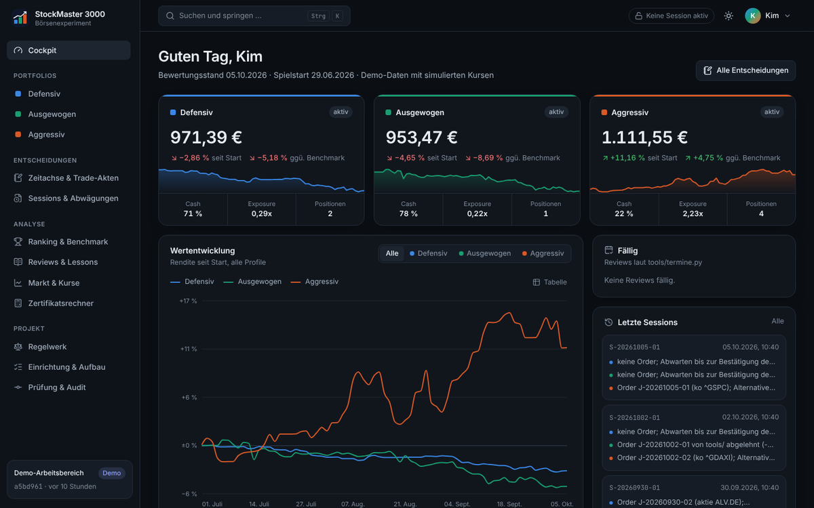
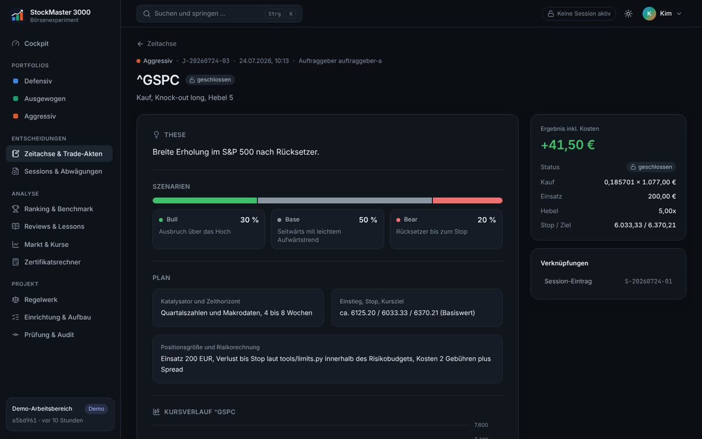

# StockMaster 3000 – Claude-Börsenexperiment

[](https://github.com/TenOfNine/StockMaster3000/actions/workflows/pruefung.yml)

Claude handelt als institutioneller Portfoliomanager drei
Spielgeld-Portfolios mit je 1.000 EUR und entwickelt daraus die
bestmögliche Strategie. Jede Entscheidung ist begründet, jede Buchung
nachrechenbar, jede Änderung in Git nachvollziehbar.

> **Simulation.** Kein echtes Geld, kein echter Handel, keine
> Anlageberatung.

## Projektstand

| Phase | Inhalt | Stand |
| --- | --- | --- |
| 1 Aufbau | Werkzeuge, Tests, GitHub Action, Initialisierung (AP1–AP11) | abgeschlossen (2026-10-06) |
| 2 Startbetrieb | Testsession, Anlagerichtlinien, Freigabe, Spielstart (AP12); autarker Docker-Stack mit Einrichtung, Claude-Sessions im Container, Kursen und News | in Vorbereitung |
| 3 Bewertung | Profile gegen Benchmarks nach etwa drei Monaten | offen |
| 4 Langzeitbetrieb | Quartals-Meta-Reviews | offen |

Aktueller Stand, Entscheidungen und offene Fragen: [STATUS.md](STATUS.md).

## Grundidee

**Rechnen macht Code, Entscheiden macht Claude.** Kurse, Ausführung,
Zertifikatswerte, Zinsen, Limits und Kennzahlen kommen ausschließlich aus
getesteten Python-Werkzeugen. Claude recherchiert, entscheidet, begründet
und lernt. So bleiben die Ergebnisse reproduzierbar und unabhängig
prüfbar, obwohl Claude seine eigenen Trades verwaltet.

| | Defensiv | Ausgewogen | Aggressiv |
| --- | --- | --- | --- |
| Max. Anteil Zertifikate | 10 % | 30 % | 70 % |
| Max. Hebel je Zertifikat | 3x | 5x | 10x |
| Max. Risiko je Trade | 1 % | 2 % | 5 % |
| Benchmark (MSCI World / Cash) | 30 / 70 | 60 / 40 | 100 / 0 |

Verbindlich sind allein [regeln.md](regeln.md) und
`config/profile.json`.

Weitere Eckpunkte:

- Aktien und ETFs (Xetra, NYSE, NASDAQ) sowie synthetische Knock-out- und
  Faktor-Zertifikate, long und short, nach festen Formeln.
- Cash-Zins 2 % p. a., Gebühr 1 EUR je Order, feste Spreads,
  Mindestorder 100 EUR.
- Kein Backdating: Orders außerhalb der Handelszeit werden zum nächsten
  Eröffnungskurs ausgeführt; im Zweifel gilt die ungünstigere Annahme.
- Zweistufige Drawdown-Bremse je Profil; Portfolio-Stopp unter 200 EUR.
- Vor jeder Order steht ein Journal-Eintrag mit These, Szenarien, Stop,
  Kursziel, Risikorechnung und Quellen. Jede Session endet mit einem
  Session-Eintrag, der auch begründetes Nichtstun festhält.

## Ablauf einer Trading-Session

1. Session-Sperre setzen, damit nie zwei Sessions gleichzeitig laufen.
2. Versäumte Handelstage nachbuchen und alles mit dem Prüfskript
   kontrollieren.
3. Regeln, Strategien, Lessons, Ranking und letzte Einträge lesen;
   fällige Reviews zuerst erstellen.
4. Marktüberblick: Kurse über das Kurswerkzeug, News aus dem News-Speicher
   und über die Web-Suche, jeweils mit Quelle und Datum.
5. Je Portfolio entscheiden; für jede Order erst Journal, dann Buchung.
6. Session-Eintrag, Bericht, Prüfung, lokaler Commit im Datenverzeichnis,
   Sperre lösen. Spielstand wird nie gepusht.

Die vollständige Arbeitsanweisung steht in [CLAUDE.md](CLAUDE.md).

## Framework und Spielstand

Dieses Repository ist nur das **Framework**: Code, Regeln, Konfiguration,
Vorlagen, Tests und Doku. Der **Spielstand** (Portfolios, Trades, Kurse,
News, Journal, Reviews, Strategien) lebt in einem eigenen Datenverzeichnis
(`STOCKMASTER_DATA_DIR`, im Container `/data`) mit eigenem, lokalem Git als
Prüfspur, ohne Remote. Im Betrieb läuft alles im Docker-Stack; Sessions
starten in der Web-UI oder per Zeitplan.

## Schnellstart

Voraussetzungen: Python 3.11 oder neuer, Git, Claude Code.

```bash
pip install -r requirements.txt
python -m pytest -q                                   # Tests ohne Netzwerk
python tools/datenverzeichnis.py einrichten --ziel ~/stockmaster-daten
export STOCKMASTER_DATA_DIR=~/stockmaster-daten
python tools/pruefe.py                                # unabhängige Kontrolle
```

Im Docker-Betrieb startet ein Admin Sessions unter „Claude-Läufe“. Lokal
startet ein Auftraggeber eine Session in Claude Code mit einer Nachricht
wie:

> Ich bin Auftraggeber `<kennung>`, starte eine Trading-Session.

Die Kennungen der Auftraggeber stehen in `config/projekt.json`.

## Werkzeuge (`tools/`)

| Befehl | Zweck |
| --- | --- |
| `python tools/session.py start --person <kennung> [--art testsession\|richtlinien\|review]` / `ende` / `status` | Session-Sperre |
| `python tools/richtlinien.py status` / `standard` / `vorlage --profil <p>` | Anlagerichtlinien: Stand, Standard-Richtlinien übernehmen, Vorlage mit den Limits |
| `python tools/kurse.py aktuell <ticker...>` | aktuelle Kurse, protokolliert in `data/kurse/` |
| `python tools/kurse.py historie <ticker> --von --bis` | Tagesdaten mit Dividenden und Splits |
| `python tools/kurse.py markt [--historie]` | Marktübersicht für die Web-UI (Fallback-Kette, „veraltet“) |
| `python tools/news.py abrufen` / `liste [--ticker X]` | News-Speicher über RSS |
| `python tools/datenverzeichnis.py einrichten` / `commit -m` / `status` | Datenverzeichnis mit lokalem Git |
| `python tools/migriere.py --von <alte-arbeitskopie>` | Spielstand aus dem alten Layout übernehmen |
| `python tools/limits.py pruefen --profil ... --typ ...` | Kauforder gegen die Limits prüfen, ohne Buchung |
| `python tools/buchen.py kaufen/verkaufen/aendern/storno ...` | Orders, nur mit Journal-ID |
| `python tools/bewertung.py nachbuchen` / `bericht` / `review` | Nachbuchung, `ranking.md`, Pflicht-Review |
| `python tools/pruefe.py [--historie]` | unabhängige Kontrolle |
| `python tools/termine.py` | fällige Reviews (nach Spielzeit: 7, 28, 91 Tage; Drawdown-Stufe 2) |
| `python tools/init.py --startdatum JJJJ-MM-TT --freigabe <kennung>` | Spielstart, einmalig nach Freigabe (AP12) |
| `python tools/produkte.py ko/faktor ...` | Zertifikatsrechner, nur Anzeige |

Die GitHub Action ([.github/workflows/pruefung.yml](.github/workflows/pruefung.yml))
führt bei jedem Push die Tests und `pruefe.py --historie` gegen ein frisch
initialisiertes und ein Demo-Datenverzeichnis aus.

## Repository-Struktur

    CLAUDE.md, regeln.md        Arbeitsanweisung und verbindliche Spielregeln
    STATUS.md                   Projektstand, Entscheidungen
    KONZEPT.md                  Zweck, Rollen, Architektur, Risiken
    AUFTRAG_PHASE1.md           Aufbau der Werkzeuge (AP1–AP12)
    AUFTRAG_WEBUI.md            Plan der Web-UI (W0–W17)
    config/                     Limits, Kosten, Universum, Projektwerte
    tools/                      Python-Werkzeuge (rechnen, buchen, prüfen)
    tests/                      Tests ohne Netzwerk, inkl. Szenario-Tests
    vorlagen/datenverzeichnis/  leere Vorlage des Datenverzeichnisses (Spielstand
                                liegt nie im Repository, sondern im Volume)
    assets/icons/               App-Icon (drei Profile)
    webui/                      Web-UI: backend/ (FastAPI), frontend/ (React),
                                deploy/ (Docker, Caddy), demo/ (Demo-Daten)
    docker-compose.yml          Betrieb der Web-UI (webui/BETRIEB.md)

## Web-UI

Die Weboberfläche läuft per Docker (Portainer-tauglich), standardmäßig nur
im Heimnetz (HTTPS mit lokaler Zertifizierungsstelle). Einstellungen und
Secrets werden in der App gepflegt; der Stack braucht nur `SM_HOSTNAME`.



- **Cockpit:** Portfolios mit Rendite gegen Benchmark, Wertentwicklung,
  fällige Reviews, letzte Sessions und Entscheidungen.
- **Portfolios:** Positionen, Orders, Trades, Limit-Auslastung,
  Drawdown gegen die Bremsschwellen, Anlagerichtlinie.
- **Entscheidungen:** Zeitachse und Trade-Akten mit These, Szenarien,
  Kursdiagramm (Einstieg, Stop, Ziel, Ausführungen), Limitprüfung zur
  Ausführung und Quellen; Session-Einträge mit verworfenen Alternativen.
- **Analyse, Regelwerk, Roadmap & Status, Prüfung:** Ranking, Reviews und
  Lessons, Markt & Kurse (Quelle, Zeitstempel, „veraltet“), News je Wert,
  Zertifikatsrechner, Regeln und Limits, Arbeitspakete und
  Auslegungsfragen, `pruefe.py` per Knopfdruck, Git-Historie.
- **Einrichtung (Admin):** Claude-Token, Modell und Aufwand, Kursanbieter
  und Keys, News-Feeds, Zeitplan, Spielstart, Sicherung, Systemstatus.
- **Claude-Läufe:** Trading-Sessions, Reviews und Testsession im Container
  mit Live-Log und anschließender Prüfung.
- **Sicherheit:** Anmeldung mit Argon2id (nur Passwort; Zwei-Faktor-Code
  nur zum Anlegen neuer Benutzer), CSRF-Schutz, Sitzungs-Timeouts, Rate-Limits, Audit-Log,
  strikte Content-Security-Policy, Heimnetz-Schranke in Proxy und API.



Die Web-UI rechnet und bucht nicht selbst; Kennzahlen, Bewertungen,
Kurse und Prüfungen kommen aus `tools/`. Start, Root-Zertifikat, Sicherung und
Entwicklung: [webui/BETRIEB.md](webui/BETRIEB.md); Betrieb mit Portainer:
[webui/PORTAINER.md](webui/PORTAINER.md). Weitere Ausbaustufen
(Arbeitsbereiche, Schwerpunkt, Profilauswahl): [AUFTRAG_WEBUI.md](AUFTRAG_WEBUI.md).

## Datenschutz

Im Repository stehen keine Namen oder personenbezogenen Daten. Personen
erscheinen nur als neutrale Kennung (`config/projekt.json`). Ältere
Commits der Git-Historie bleiben bewusst unverändert, damit die Prüfspur
intakt bleibt ([STATUS.md](STATUS.md), Entscheidung 12).

## Haftungsausschluss

Dieses Projekt ist ein Experiment mit Spielgeld. Nichts in diesem
Repository ist eine Anlageberatung oder eine Empfehlung zum Kauf oder
Verkauf von Wertpapieren.
